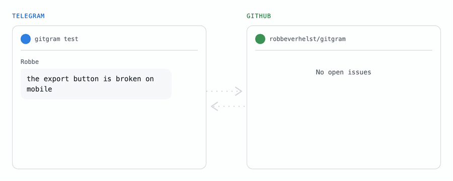

<picture>
  <source media="(prefers-color-scheme: dark)" srcset=".github/assets/banner-dark.svg">
  
</picture>

<p align="center">
  <a href="https://github.com/robbeverhelst/gitgram/actions/workflows/ci.yml"></a>
  <a href="https://github.com/robbeverhelst/gitgram/releases"></a>
  <a href="https://github.com/robbeverhelst/gitgram/pkgs/container/gitgram"></a>
  <a href="LICENSE"></a>
</p>

<p align="center">
  <a href="#quickstart">Quickstart</a> ·
  <a href="#configuration">Configuration</a> ·
  <a href="#silent-mode">Silent mode</a> ·
  <a href="#troubleshooting">Troubleshooting</a> ·
  <a href="docs/DESIGN.md">Design</a>
</p>

---

<p align="center">
  <picture>
    <source media="(prefers-color-scheme: dark)" srcset=".github/assets/demo-dark.gif">
    
  </picture>
</p>

The bug report was already written. Someone typed it in the group chat three
weeks ago, four people replied "yeah same", and then it scrolled away. Nobody
was ever going to open the issue tracker and type it again.

**gitgram** closes that gap. React 👀 to the message and it becomes a GitHub
issue — quoted verbatim, credited to whoever wrote it, linked back to the
conversation. When the issue closes, the bot says so in the chat. Both
announcements are per-chat toggles, so it can also work entirely silently.

## How it works

A `message_reaction` update carries no message text, and the Bot API cannot
fetch a message by id. So gitgram forwards the reacted-to message into a private
archive channel — `forwardMessage` returns the full `Message` — and reads it
from the response. The issue↔message link lives in an HTML comment in the issue
body, so GitHub is the only durable store. There is no database.

See [docs/DESIGN.md](docs/DESIGN.md) for the reasoning and the trade-offs.

## Prerequisites

- The group must be a **supergroup**. Basic groups have no per-message links.
- The bot must be a **group administrator**. Telegram sends no reaction updates
  otherwise, and there is no way around it.
- The group must **not** have "restrict saving content" enabled — forwarding
  fails outright, and gitgram cannot read the message.
- Telegram privacy mode can stay **on** (the default). gitgram never needs to
  read ordinary group messages.

## Quickstart

### 1. Telegram

Create a bot with [@BotFather](https://t.me/BotFather) and copy the token.

**The group.** New group → add the bot → then:

- **Make it a supergroup.** New groups start as *basic* groups, which have no
  per-message links. Group → Edit → *Chat history for new members* →
  **Visible** converts it. Do this **before** collecting chat ids — converting
  changes the chat id.
- **Promote the bot to administrator.** No specific rights are needed; admin
  status alone is what makes Telegram deliver reaction updates.
- **Enable the trigger reaction.** Group → Edit → Reactions → **All**, or tick
  👀 and 👌 explicitly. If the emoji is not in the group's allowed set, nobody
  can react with it and the bot will never fire.

**The archive channel.** New *private channel* → Administrators → **Add Admin**
→ the bot. Bots can only join a channel as an administrator, never as a
subscriber.

### 2. Find the chat ids

```bash
echo 'TELEGRAM_BOT_TOKEN=...' > .env
bun install
bun run scripts/chat-ids.ts
```

Send a message in the group and post one in the archive channel, then Ctrl-C.
Adding the bot to a channel emits no update on its own — you have to post
something (or forward a channel message into the group) before its id appears.

Do not run this while the bot itself is running; Telegram delivers each update
to only one `getUpdates` caller.

### 3. Expose the webhook

GitHub needs to reach `POST /gh/webhook`. For local testing:

```bash
cloudflared tunnel --url http://localhost:3000
```

`trycloudflare.com` issues a **new hostname every restart**. When it changes,
update the App's webhook URL — otherwise ticket creation keeps working (Telegram
is long polling) while close announcements go silently missing.

### 4. Create the GitHub App

```bash
bun run scripts/create-app.ts https://<your-public-host>
```

Open <http://localhost:4000>. This hands GitHub a pre-filled manifest — Issues
read/write, Metadata read, subscribed to the Issues event, webhook URL and
secret already set — so you only click **Create GitHub App**. It writes
`GITHUB_APP_ID`, `GITHUB_APP_PRIVATE_KEY` and `GITHUB_WEBHOOK_SECRET` into
`.env` and links you to the install page.

**Then install it on the repos you want to file into.** Creating the App grants
nothing by itself.

To do it by hand instead, create an App with Issues: Read and write, Metadata:
Read-only, subscribed to **Issues**, webhook `https://<host>/gh/webhook`; then
put the App ID, the PEM (newlines escaped as `\n`) and the secret in `.env`.

### 5. Configure and run

```bash
cp gitgram.example.yaml gitgram.yaml   # add your chat_id and repo
echo 'ARCHIVE_CHAT_ID=-100...' >> .env
```

**With Docker:**

```bash
docker run --rm \
  --env-file .env \
  -v "$PWD/gitgram.yaml:/app/gitgram.yaml:ro" \
  -p 3000:3000 \
  ghcr.io/robbeverhelst/gitgram:latest
```

**From source:**

```bash
bun install
bun run start
```

Either way, sanity-check with `/gitgram` in the group — it replies with the chat
id and the resolved settings, or tells you the chat is not configured.

## Configuration

Secrets live in the environment (see `.env.example`); routing lives in
`gitgram.yaml` (see `gitgram.example.yaml`). Invalid config fails at boot rather
than producing a bot that silently ignores you.

| Key | Default | |
|---|---|---|
| `repo` | required | `owner/name` |
| `authorize` | `anyone` | `anyone`, `admins`, or a list of Telegram user ids |
| `announce_created` | `true` | post in the chat when a ticket is filed |
| `announce_closed` | `true` | post in the chat when it is closed |
| `ack_reaction` | `true` | bot adds `ACK_EMOJI` to the message |
| `include_link` | `false` | put the issue URL in announcements — off by default because the URL names the repo to everyone in the chat |
| `title_mode` | `mechanical` | `llm` is reserved, not implemented |
| `labels` | `[]` | labels applied to created issues |

`TRIGGER_EMOJI` and `ACK_EMOJI` must be from Telegram's standard reaction set —
🎫 and ✅ are **not** in it. The full list is in `src/reactions.ts`, and an
invalid value fails at boot.

## Silent mode

`announce_created: false` + `announce_closed: false` stops gitgram talking in
the chat. The 👌 ack reaction still fires, so the reactor can tell the difference
between "filed quietly" and "bot is down".

**Errors always speak**, at any setting. The person who needs to know a ticket
was not filed is the one who just reacted.

## Development

```bash
bun run dev        # watch mode
bun test           # unit + fake-transport end-to-end
bun run ci         # lint, typecheck, test
```

### Scripts

| | |
|---|---|
| `scripts/chat-ids.ts` | prints the id of every chat the bot can see |
| `scripts/create-app.ts <url>` | creates the GitHub App via the manifest flow and writes `.env` |
| `scripts/fake-close.ts <chat_id> <message_id> [issue]` | replays a signed `issues.closed` at a local instance |

`fake-close.ts` is the fastest way to tell a broken webhook apart from a broken
bot: if it announces, the bot is fine and the problem is the tunnel URL or the
secret.

## Troubleshooting

**Nothing happens when I react.** In order of likelihood: the emoji is not in
the group's allowed reactions; the bot is not an administrator; the chat id in
`gitgram.yaml` is stale (converting a basic group to a supergroup changes it —
check with `/gitgram`).

**Tickets are created but closes are never announced.** The webhook is not
arriving. Check the App → Advanced → Recent Deliveries for the response code,
and bypass the tunnel with `scripts/fake-close.ts` to isolate it. Deliveries
that fail while the bot is down are **not** retried; redeliver them by hand.

**"this group has content forwarding restricted".** The group has "restrict
saving content" enabled. There is no workaround — gitgram cannot read the
message.

## Deployment

Multi-arch images (`linux/amd64`, `linux/arm64`) are published to
`ghcr.io/robbeverhelst/gitgram` on every `v*` tag — `latest`, plus `{major}`,
`{major}.{minor}` and the full version. See [Quickstart](#5-configure-and-run)
for the `docker run` invocation.

Mount `gitgram.yaml` at `CONFIG_PATH` (default `/app/gitgram.yaml`) and supply
the secrets as environment variables.

The container needs inbound HTTPS on `PORT` for the GitHub webhook; Telegram
uses long polling and needs no inbound access. It holds no state, so it can be
restarted or rescheduled freely — updates queue on Telegram's side meanwhile.

## Known limits

- **Media cannot be attached to issues** — GitHub has no public API for it. The
  issue carries the caption and a link to the archived forward.
- **A close announcement is lost if the bot is down.** GitHub does not retry
  failed webhook deliveries; redeliver by hand from the App's Advanced tab.
- **Removing the reaction does nothing.** Reactions are removed by accident too
  easily to let one close real work.
- **Dedup across restarts is best-effort.** GitHub's issue search index lags,
  so a re-reaction within that window can file twice.

## Contributing

PRs welcome. `bun install`, `bun run ci`, conventional commits.

## License

[MIT](LICENSE)
